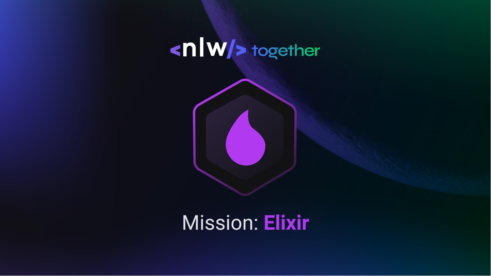
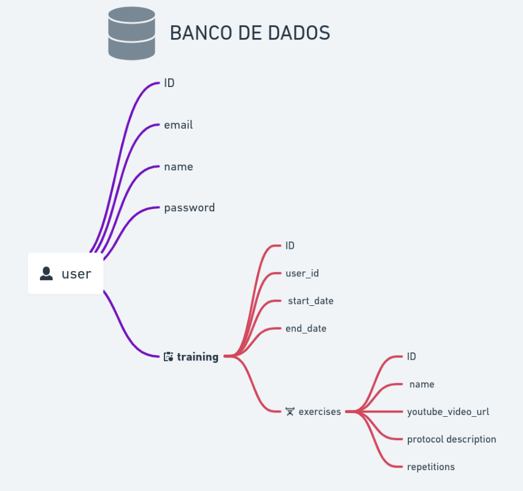

<h1 align="center">
    
</h1>

<h4 align="center"> 
	:construction:  NextLevelWeek Together 🚀 In progress... :construction:
</h4>
<p align="center">	

	
  
	
  <a href="https://www.linkedin.com/in/danielobara/">
    
  </a>

  <a aria-label="Completed" href="https://nextlevelweek.com/episodios/elixir/aula-1/edicao/6">
    </img>
  </a>
  
  <a href="https://github.com/DanielObara/NLW-1.0/commits/master">
    
  </a>

  
   <a href="https://github.com/DanielObara/NLW-Together-Elixir/stargazers">
    
  </a>
</p>

<p align="center">
  <a href="#-nlw">Next Level Week</a>&nbsp;&nbsp;&nbsp;|&nbsp;&nbsp;&nbsp;
  <a href="#-project">Project</a>&nbsp;&nbsp;&nbsp;|&nbsp;&nbsp;&nbsp;
  <a href="#rocket-Technologies">Technologies</a>&nbsp;&nbsp;&nbsp;|&nbsp;&nbsp;&nbsp;
  <a href="#-material">Material</a>&nbsp;&nbsp;&nbsp;|&nbsp;&nbsp;&nbsp;
  <a href="#-how-to-use">How to use</a>&nbsp;&nbsp;&nbsp;|&nbsp;&nbsp;&nbsp;
  <a href="#-how-to-contribute">How to contribute</a>&nbsp;&nbsp;&nbsp;|&nbsp;&nbsp;&nbsp;
  <a href="#memo-license">License</a>
</p>

## :information_source: What's Next Level Week?

NLW is a practical week with lots of code, challenges, networking and a single objective: to take you to the next level.
Through our method you will learn new tools, learn about new technologies and discover hacks that will boost your career.
An online and completely free event that will help you take the next step in your evolution as a dev.

### Classes
- Class 01 - Liftoff - 20/06 - :heavy_check_mark:
- Class 02 - Maximum Speed - 21/06 - :construction:
- Class 03 - In Orbit - 22/06 - :construction:
- Class 04 - Landing - 23/06 - :construction:
- Class 05 - Surface Exploration - 24/06 - :construction:

## 💻 Project

Wabanex is a project to manage and monitor your workouts at the gym. Project organized by Rocketseat and taught by Rafael Camarda

<h1 align="center">
    
</h1>


## :rocket: Technologies

This project was developed with the following technologies:

- [Elixir][elixir]
- [Erlang][erlang]
- [Phoenix][phoenix]
- [PostgreSQL][postgres]

## 🔖 Material

To access the complementary material take a look at [Whimscal](https://whimsical.com/wabanex-nlw-together-HX8K2N8J2cafinMFnRWQ6J).

## :information_source: How To Use

To clone and run this application, you'll need [Git](https://git-scm.com), [PostgreSQL][postgres] or an postgres image on[Docker](https://www.docker.com/get-started), [Elixir][elixir] + [Erlang][erlang] installed on your computer.

From your command line:

### Install API 

```bash
# Clone this repository
$ git clone https://github.com/DanielObara/NLW-Together-Elixir

# Go into the repository
$ cd wabanex

# Setup
$ mix ecto.setup

# Start server
$ mix phx.server

# Remember that you will need to start your postgreSQL in local or an Docker image

# running on port 4000
```
## 🤔 How to contribute

-  Make a fork;
-  Create a branch with your feature: `git checkout -b my-feature`;
-  Commit changes: `git commit -m 'feat: My new feature'`;
-  Make a push to your branch: `git push origin my-feature`.

After merging your receipt request to done, you can delete a branch from yours.

## :memo: License

This project is under the MIT license. See the [LICENSE](https://github.com/DanielObara/NLW-Together-Elixir/blob/main/LICENSE) for details.

Made with ♥ by Daniel Obara :wave: [Get in touch!](https://www.linkedin.com/in/danielobara/)

[elixir]: https://elixir-lang.org/
[erlang]: https://www.erlang.org/
[phoenix]: https://www.phoenixframework.org/
[postgres]: https://www.postgresql.org/download/
